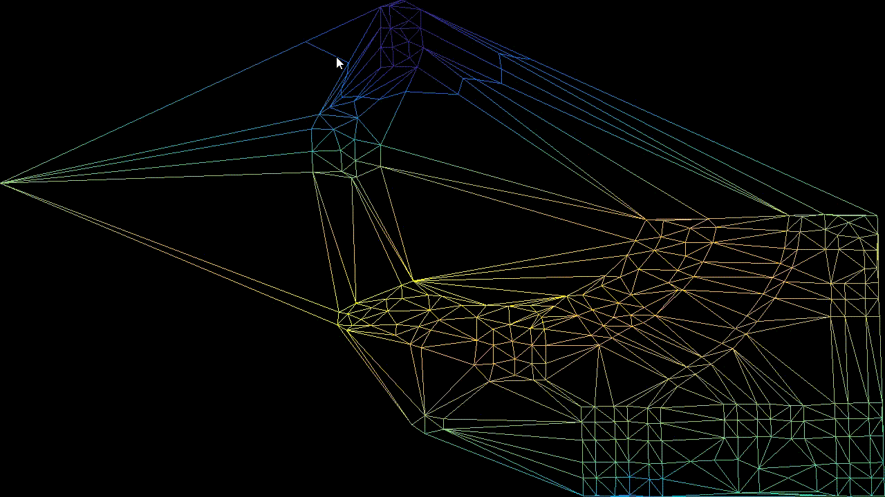

This is an efficient incremental implementation of Delaunay Triangulation, one of the most important algorithms in computation geometry. The idea behind this implementation is explained in detail in [edX Computational Geometry course](https://www.edx.org/course/computational-geometry) taught by Deng Junhui.

This particular program tries to use DT to solve the terrain modelling problem in geometric information systems (GIS): given a set of non-uniformly distributed points on 2D plane with elevation values, how to reconstruct the terrain such that it is smooth an has good locality, the answer is of course using Delaunay triangulation of the point set and interpolate the elevation value within each triangle.

This program also implements contour line tracing on a triangular mesh. The contour tracing routine runs on a per frame basis so that the contour line corresponding to the current mouse position is displayed in real-time.

All the drawing code, including the triangle mesh and the contour line, is written using Modern OpenGL programmable pipeline, so a graphics card compatible with OpenGL 3.3+ is required to run the program.

